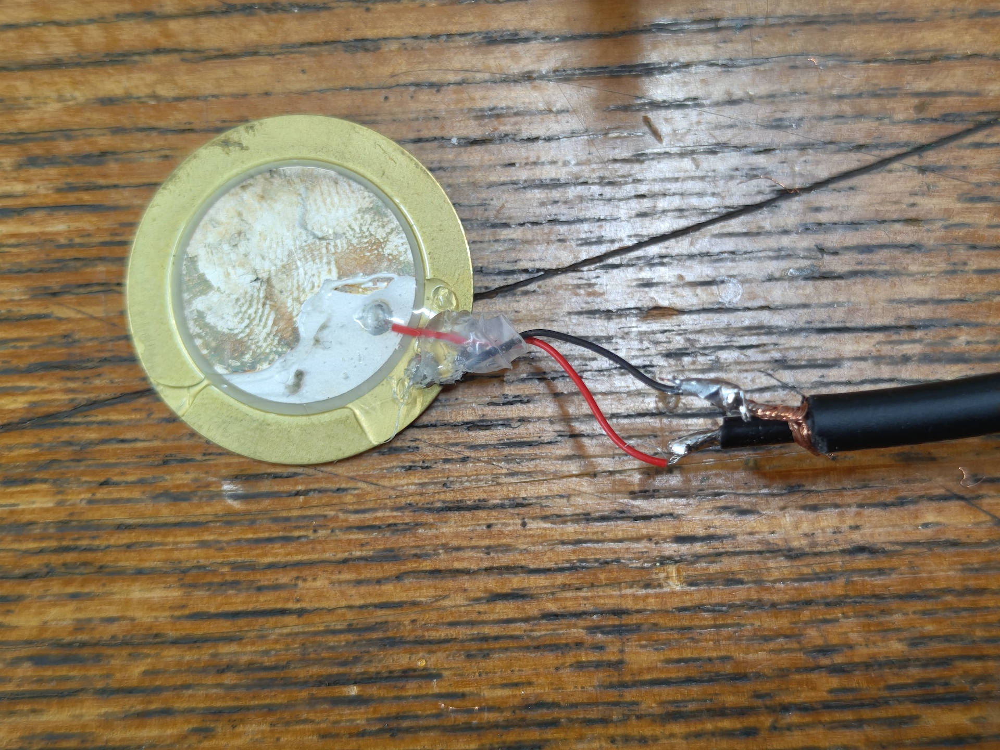
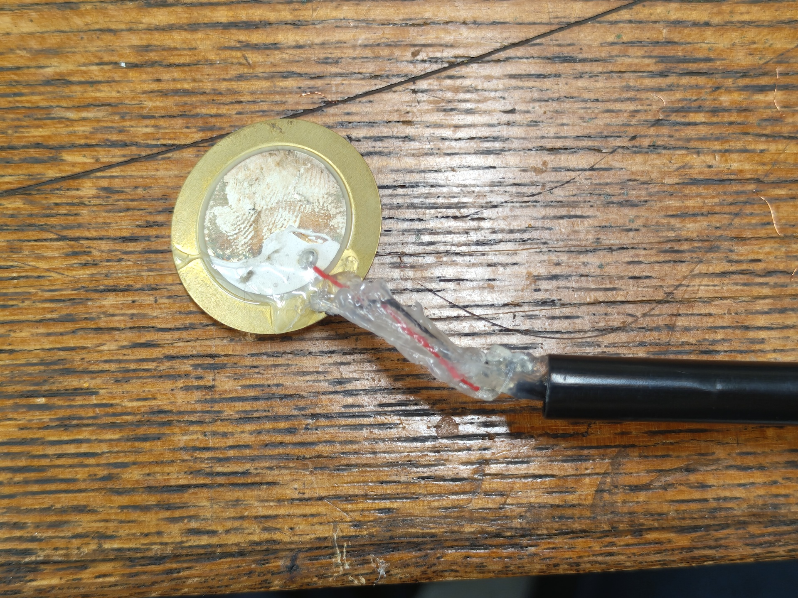
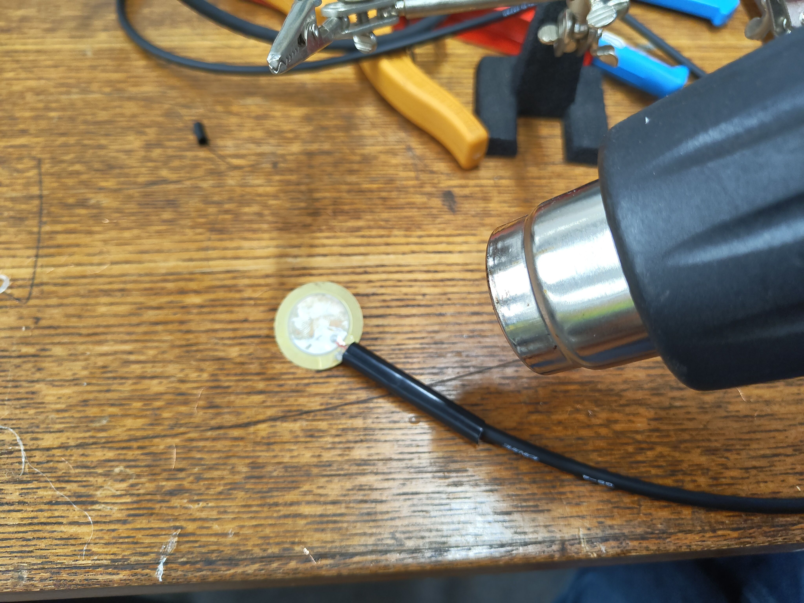
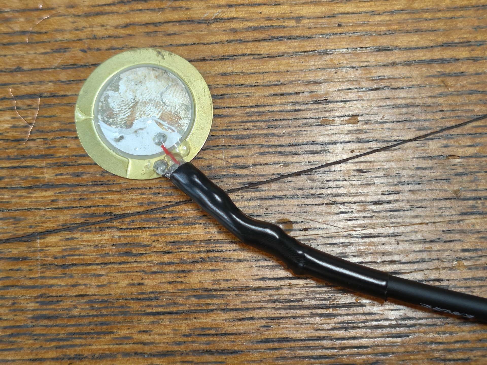

# Production Procedure for Custom Contact Microphone (Vibration Sensor)

## Materials

- Piezo element (piezoelectric sounder) 27mm diameter with lead wires
    - Such as those from [Murata Manufacturing](https://akizukidenshi.com/catalog/g/g113209/).
- Single-core shielded cable, 4mm diameter, about 2m per unit
    - [Example: CANARE GS4](https://www.soundhouse.co.jp/products/detail/item/167365/)
    - 2-core or 4-core mic cables can also be used, using just one of the cores.
- 3.5mm stereo mini plug
    - [Example: CANARE F12S](https://www.soundhouse.co.jp/products/detail/item/310266/)
    - Those labeled as "3-pole" or "TRS" can also be used instead of stereo.
- Heat shrink tube, 4.5mm inner diameter before shrinking, 2mm after shrinking

### Tools

- Cable stripper (a cutter or wire cutter can be used if unavailable)
- Soldering iron and solder
- Glue gun
- Heat gun or lighter (for shrinking heat shrink tubes)

## Production Procedure

### Stripping the Cable Sheath

Cut the cable to about 2m in length.

Strip about 15mm from one end, leaving the part inside the shield wire (the tubular metal part).

Loosen the shield wire and twist it together. It is easier to solder if you cut off some excess before twisting so that
the twisted thickness is about the same as the inner core wire.

Strip about 5mm of the inner insulation as well, and lightly twist it. Some cables may have paper or fabric insulation
inside the shield wire, so cut these off if they are in the way.

### Soldering the Plug

Turn on the soldering iron.

Apply pre-solder to the shield wire and core wire.

Remove the cover of the stereo mini plug, and insert the core wire into the hole of the Tip terminal (the terminal
extending from the very center of the plug) and the shield wire into the hole of the Sleeve terminal (the long terminal
extending from the outermost part of the plug). Leave the remaining terminal as is[^trs].

After soldering, lightly crimp the Sleeve terminal with pliers or similar, pass the plug cover through from the opposite
side of the cable, and screw it in to secure.

[^trs]: This connection method connects an unbalanced output piezo mic to the balanced input of an audio interface.
There is another method where the Ring terminal (which we are not connecting here) is shorted with the Sleeve terminal.
Using a mono (TS) plug would automatically create this connection. We have chosen this method based on overall
considerations including ease of obtaining parts and simplicity of soldering.

### Passing the Heat Shrink Tube

Cut the heat shrink tube to about 2-3cm and pass it through the cable in advance. Note that you will not be able to do
this after soldering the mic, so be careful.

### Soldering the Piezo Element

Strip the insulation from the opposite end of the cable as before. Cut the cable coming out of the piezo element leaving about 2cm, and strip about 5mm of insulation.

Solder the red wire from the piezo mic to the core wire, and the black to the shield wire[^nocable].

[^nocable]: If using a piezo element without attached cables, solder the core wire to the inner ceramic part and the
shield wire to the outer metal part. The ceramic part is particularly difficult for solder to adhere to, so we recommend
using flux.

Protect the soldered parts with a glue gun to prevent short circuits. Also protect the soldered parts of the piezo and
cable with the glue gun to prevent disconnection due to movement. (Be careful not to apply too much glue gun material as
it may interfere when attaching the cover.)

Move the shrink tube to the piezo mic side and shrink it using a heat gun or lighter.

If necessary, protect the piezo mic with liquid rubber (the kind that dries naturally) to prevent rust and deterioration.

[Reference product: Yutaka Make Liquid Rubber](https://yutakamake.co.jp/product/origin/origin05/1630)

## Printing the Attachment Cover for Tone Chimes (Optional)

The sensor is attached to the tone chime using reusable adhesive like Blu-Tack. As an option, we have made an attachment
that can be 3D printed to protect the soldered part of the cable and make it easier to attach.

As tone chimes come in two thicknesses depending on the pitch, we have prepared model data for both large and small
sizes.

|       |                         Main Cover                         |                       Cable Clip                       |
|:-----:|:----------------------------------------------------------:|:------------------------------------------------------:|
| Large | [piezo_cover_large.stl](../../3dmodels/piezo_cover_large.stl) | [cableclip_large.stl](../../3dmodels/cableclip_large.stl) |
| Small | [piezo_cover_small.stl](../../3dmodels/piezo_cover_small.stl) | [cableclip_small.stl](../../3dmodels/cableclip_small.stl) |

When 3D printing, please print vertically with the disc part where the piezo is attached facing upwards, as shown in the
image below. If printed lying down, the layering direction may cause it to break when fitted onto the tone chime.

Use the `cableclip` model as needed to secure the cable at the end.