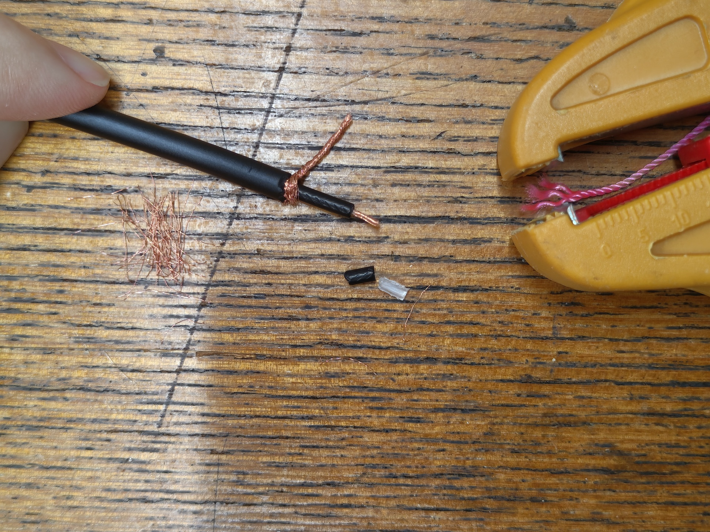
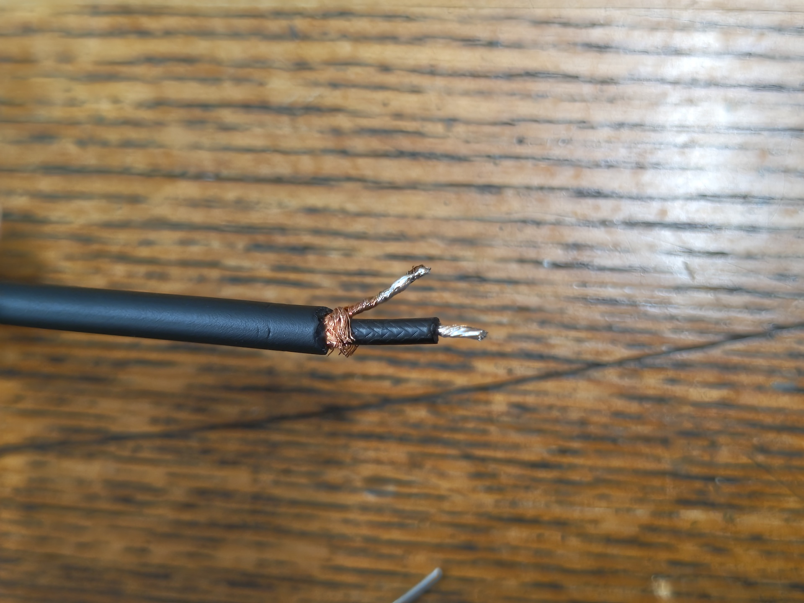
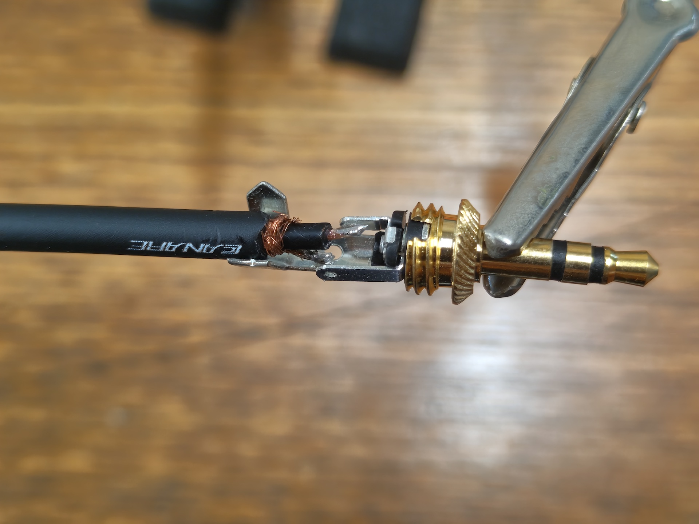
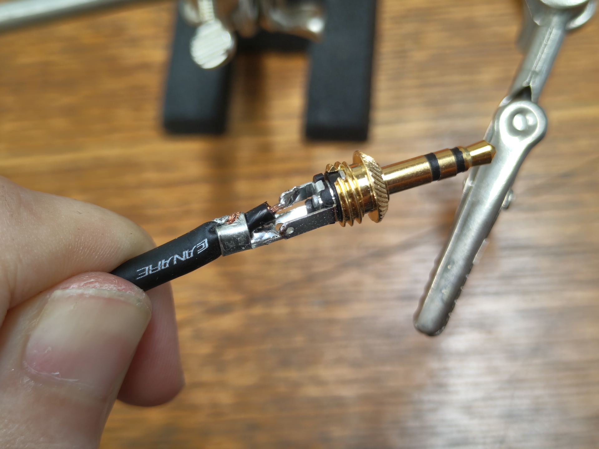
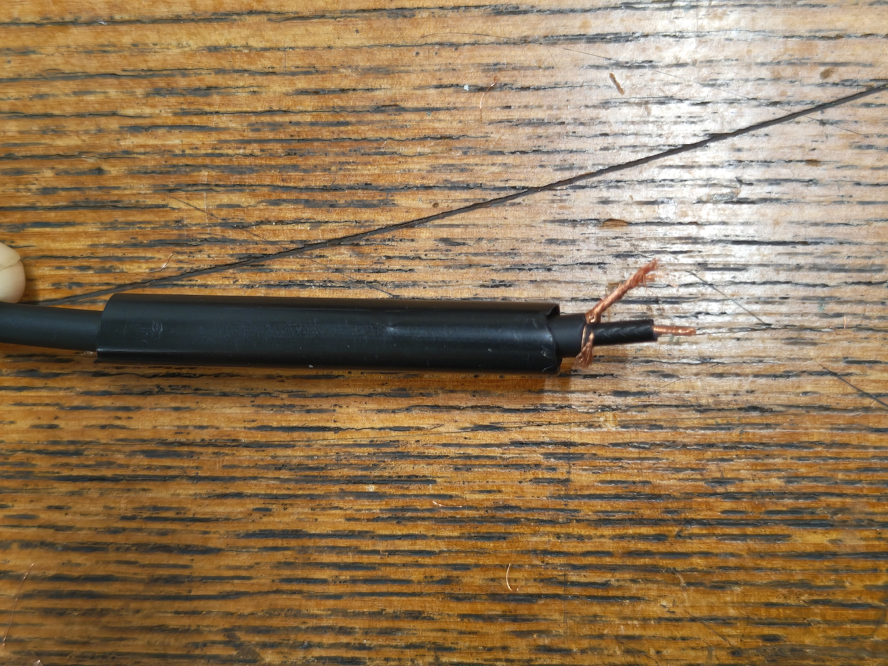
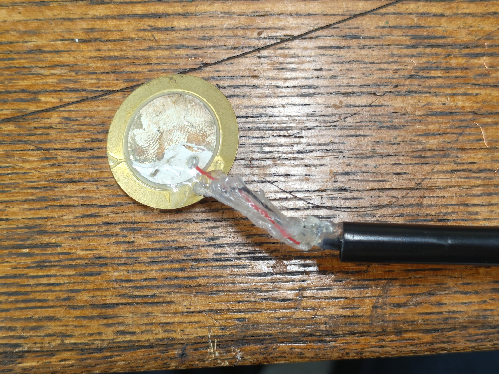
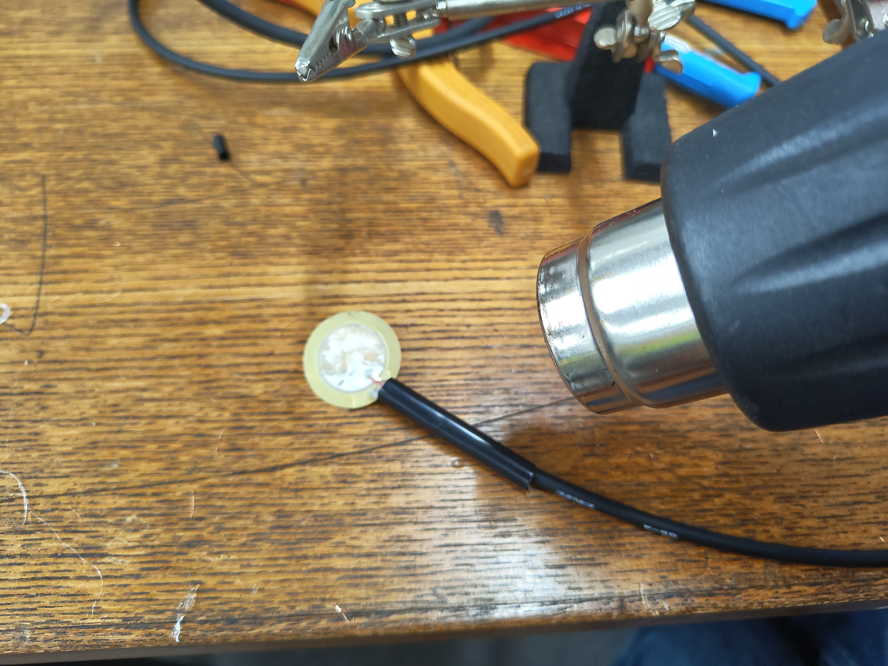
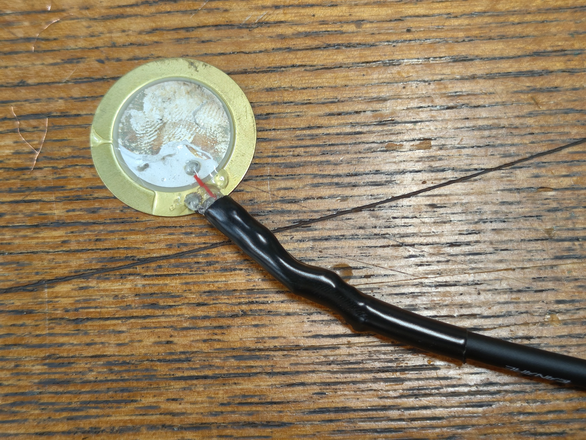

# 特製コンタクトマイクロフォン（振動センサー）の制作手順

## 材料

- ピエゾ素子（圧電サウンダ） 直径27mmのもの リード線付き
    - [村田製作所](https://akizukidenshi.com/catalog/g/g113209/)のものなど。
- 1芯シールドケーブル 直径4mm 1つあたり2m程度
    - [例：CANARE GS4](https://www.soundhouse.co.jp/products/detail/item/167365/)
    - 2芯や4芯のマイクケーブルでも、うち1本だけを使う形で使用可能です。
- 3.5mmステレオミニプラグ
    - [例：CANARE F12S](https://www.soundhouse.co.jp/products/detail/item/310266/)
    - ステレオの代わりに「3極」や「TRS」という名前のものでも大丈夫です。
- 熱収縮チューブ 収縮前内径4.5mm 収縮後2mmのもの

## 道具

- ケーブルストリッパー（なければカッターやニッパーでも）
- はんだごて・はんだ
- グルーガン
- ヒートガンやライター（熱収縮チューブを縮める用）

## 制作手順

### ケーブルの被覆を剥く

ケーブルを2m程度にカットします。

片側の端を、シールド線（筒状になっている金属部）より内側を残して15mm程度剥きます。

シールド線をほぐして、捻ってまとめておきます。捻った太さが内側の芯線の太さと同じ程度になるよう、ある程度切り落としてから捻るとはんだ付けしやすくなります。

内側の被覆も5mm程度剥がして、軽く捻っておきます。ケーブルによってはシールド線の内側に紙や布の被覆がある場合もあるので、邪魔にならないようカットしておきましょう。

### プラグをはんだ付けする

はんだごての電源を入れます。

シールド線と芯線に予備はんだを染み込ませておきます。

ステレオミニプラグのカバーを外し、Tip端子（プラグの一番中心から伸びている端子）の穴に芯線を、Sleeve端子（プラグの一番外側から伸びている長い端子）の穴にシールド線を通します。残った1つの端子はそのままにしておきます[^trs]。

はんだ付けし終わったら、Sleeve端子を軽くペンチなどでかしめ、ケーブルの反対側からプラグのカバーを通し、ねじ込んで固定します。

[^trs]: 今回の接続は、オーディオインターフェースのバランス入力に、アンバランス出力のピエゾマイクを接続する方法になります。今回接続していないRing端子をSleeve端子とショートさせる接続方法もあり、モノラル(TS)のプラグを使用すれば自動的にその接続になります。今回は、部品の入手しやすさ、はんだ付けの簡単さなどから総合的に判断してこの接続にしています。

### 熱収縮チューブを通す

熱収縮チューブを2~3cm程度にカットし、ケーブルにあらかじめ通しておきます。マイクをはんだ付けした後は通せなくなるので注意しましょう。

### ピエゾ素子をはんだ付けする

ケーブルの反対側の端を、先ほどと同様に被覆を剥いておきます。ピエゾ素子から出ているケーブルを2cm程度残してカットし、5mm程度被覆を剥いておきます。

ピエゾマイクから出ているケーブルの、赤を芯線と、黒をシールド線とで互いにはんだ付けします[^nocable]。

[^nocable]: ケーブルの付いていないピエゾ素子を使う場合、芯線を内側のセラミック部分、シールド線を外側の金属部分にはんだ付けしましょう。セラミック部分には特にはんだが乗りにくいため、フラックスなどを使用することをお勧めします。

はんだ付けした部分同士がショートしないよう、グルーガンで保護しておきましょう。ピエゾとケーブルのはんだ付け部分も、動いて断線したりしないようグルーガンで保護しておきましょう。（あまりグルーガンを厚く盛りすぎると、カバーをつける際に干渉する可能性があるので気をつけてください。）

収縮チューブをピエゾマイク側に移動させ、ヒートガンやライターで収縮させます。

必要に応じて、液体ゴム（自然乾燥できるもの）でピエゾマイクを保護しておくと、錆びや劣化の防止になります。

[参考製品：ユタカメイク 液体ゴム](https://yutakamake.co.jp/product/origin/origin05/1630)

## トーンチャイム用アタッチメントカバーの印刷（省略可）

トーンチャイムへのセンサーの装着は、ひっつき虫のような再利用可能な粘着剤で行います。
オプションとして、ケーブルのはんだ付け部の保護や取り付けやすさのために、3Dプリンタで印刷可能なアタッチメントを制作しました。

トーンチャイムは音程によって太さが2種類あるため、モデルデータも大小用意しています。

|     |カバー本体|ケーブル留め|
|:---:| :-----: |:------:|
|大|[piezo_cover_large.stl](../../3dmodels/piezo_cover_large.stl)|[cableclip_large.stl](../../3dmodels/cableclip_large.stl)|
|小|[piezo_cover_small.stl](../../3dmodels/piezo_cover_small.stl)|[cableclip_small.stl](../../3dmodels/cableclip_small.stl)|

3Dプリントで出力する際には、以下の画像のように縦向きにしてピエゾを取り付ける円盤部分が上になるように印刷してください。寝かせて印刷すると積層の方向的に、トーンチャイムにはめる際に割れる可能性があります。

`cableclip`のモデルは、必要に応じてケーブルを端で留める際に使用してください。

