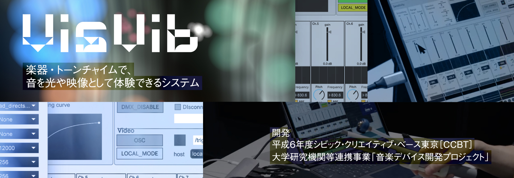

# 

## Overview

This project, **VisVib**, is a system that uses an instrument called tone chimes to experience sound as light and video.
It was developed during the process of creating music workshops that can be enjoyed by deaf and hard-of-hearing
individuals, in collaboration
with [Civic Creative Base Tokyo [CCBT]](https://ccbt.rekibun.or.jp/), [Tokyo University of the Arts Art Media Center (AMC)](https://amc.geidai.ac.jp),
and [Tokyo Bunka Kaikan](https://www.t-bunka.jp/).

To share the results of this project more widely, we have made the **VisVib** system open-source.

The development process of the device and workshop is published
in [CCBT's Research Notes](https://ccbt.rekibun.or.jp/research-notes/diverstiy-and-inclusion-project-02).

<iframe width="2014" height="1075" src="https://www.youtube.com/embed/hWaFJXojxO8" title="VisVibの使い方｜セットアップ編" frameborder="0" allow="accelerometer; autoplay; clipboard-write; encrypted-media; gyroscope; picture-in-picture; web-share" referrerpolicy="strict-origin-when-cross-origin" allowfullscreen></iframe>

<iframe width="2014" height="1075" src="https://www.youtube.com/embed/KC6nucvaL8E" title="VisVibの使い方｜実践編" frameborder="0" allow="accelerometer; autoplay; clipboard-write; encrypted-media; gyroscope; picture-in-picture; web-share" referrerpolicy="strict-origin-when-cross-origin" allowfullscreen></iframe>

## Table of Contents

1. [Preparation: Hardware](Preparation/Hardware/index.en.md)
2. [Preparation: Software](Preparation/Software/index.en.md)
3. [Setup](Setup/index.en.md)
4. [Startup and Operation](Usage/index.en.md)
5. [Troubleshooting](Troubleshooting/index.en.md)

## [License](https://github.com/ccbtokyo/visvib-manual/LICENSE)

The source code of the programs related to this project is released under the MIT License. Other documents and 3D model
data are released under Creative Commons 4.0-Attribution (CC4.0-BY).

## Credits

- Sound sensor system development: [Tomoya Matsuura (@tomoyanonymous)](https://matsuuratomoya.com)
- Video system development: Ryoya Usuha

Device development:

- [Takayuki Ito](https://ccbt.rekibun.or.jp/players/ito-takayuki) (Civic Creative Base Tokyo [CCBT] Technical Director)
- [Yuya Ito](https://ccbt.rekibun.or.jp/players/ito-takayuki)
  (Technical Director / [arsaffix](https://arsaffix.com/))
- Daiki Miura (Engineer)
- Ibuki Tada (Tsukuba University of Technology student, CCBT intern (2022-23) / Deaf)

Workshop development:

- Sayuri Ihara (Tokyo Bunka Kaikan Music Workshop Leader)
- Natsuki Sakamoto (Tokyo Bunka Kaikan Music Workshop Leader)
- Neto Sakurai (Tokyo Bunka Kaikan Music Workshop Leader)
- Karin Furuhashi (Tokyo Bunka Kaikan Music Workshop Leader)
- Sasa / Marie (SignPoet (person who weaves poetry using "hand words" in sign language), Music Accessibility
  Researcher / Deaf)

Communication support (Japanese Sign Language ⇔ Japanese):

- Alice Ishikawa
- Masayuki Shinozuka
- Mina Onuki (Tsukuba University of Technology)
- Others

## Document Management and Development

Please refer to [DEVELOPMENT](Development/index.md).
