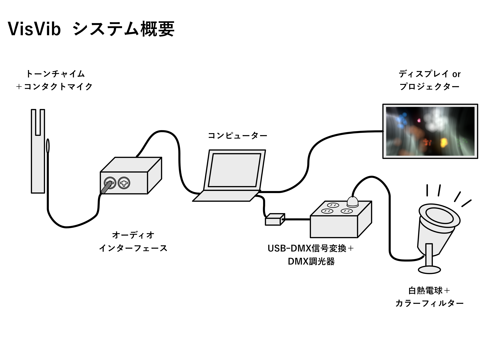
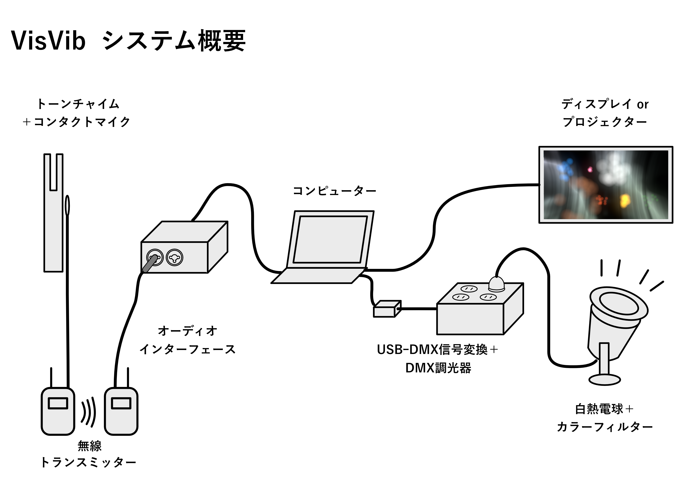
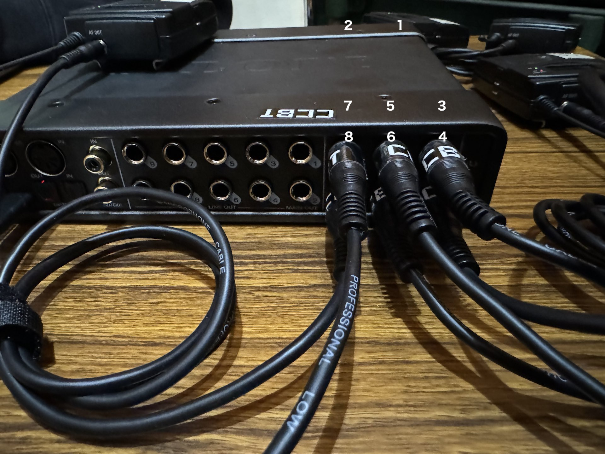
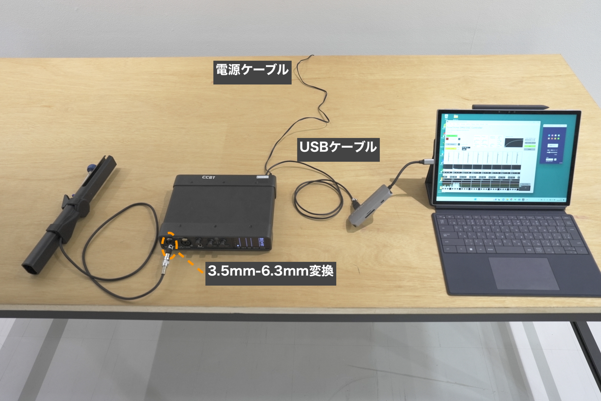
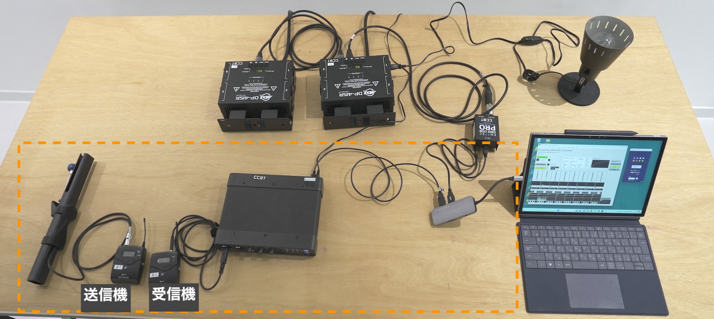
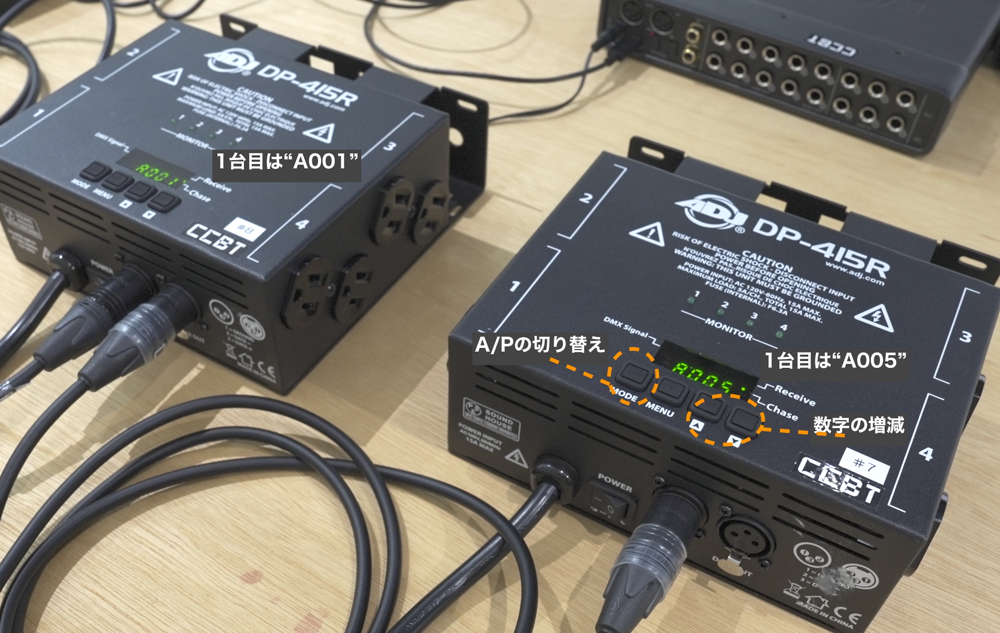

# セットアップ

## コンタクトマイクのトーンチャイムへの取り付け

コンタクトマイクの金属面の中心に、ひっつき虫のような粘着剤を貼り付け、トーンチャイムに押し当てて固定します。

マイクは、手や体が直接触れない位置で、なおかつトーンチャイム自体の振動を止めないような位置に固定する必要があります。

そのため、画像のように原則ハンマーの根本部分（音名が表記してある板）の裏側に取り付けてください。上過ぎるとトーンチャイム自体が鳴らなくなってしまい、逆に下すぎるとマイクで拾う音量が小さくなってしまいます。

3Dプリント製カバーを使用する場合は、カバーを押し込むことで固定できますが、この時もマイクとトーンチャイムの間には粘着剤を取り付けることを忘れないようにしてください。

## 全体配線図

有線接続&1台構成の場合。

無線接続&1台構成の場合。

## 音関係の接続

オーディオインターフェースにマイクを接続します。多くのインターフェースでは機器前面にチャンネル1、2の入力端子が付いていますので、2ch構成の場合はそこにマイクを入力します。

MOTU UltraLite Mk5は、前面にチャンネル1、2の入力、背面にチャンネル3から8の入力端子がついています。

### 有線接続の場合

トーンチャイムに取り付けたマイクを、オーディオインターフェースの入力に直接差し込みます。マイクのプラグは、3.5mmプラグですが、今回使うオーディオインターフェースの入力は6.3mmプラグですので、変換アダプタを使用します。

### 無線接続の場合

トーンチャイムに取り付けたマイクを、トランスミッターの送信機側（上部に「MUTE」スイッチがある方が送信機です）の入力に差し込みます。

トランスミッターの受信機から、オーディオインターフェースの入力へ、3.5mmプラグ-6.3mmプラグケーブルを使用して接続します。

## 照明関係の接続

コンピューターとDMX USB PROをUSBケーブルで繋ぎます。DMX USB PROの"DMX OUT"端子にXLR5ピン-3ピン変換プラグを繋ぎ、そこにXLRケーブルを繋ぎます。

XLRケーブルの反対側を、ディマーのDMX inに接続します。

8台構成（ディマー2台）の場合は、1台目のディマーパックのDMX OUT端子から2台目のDMX IN端子へとXLRケーブル（3ピン）を繋ぎます。ディマーを電源に繋ぎ、電源をONにします。

ディマー2台構成では、全体で上記画像のような接続になります。

#### DMXのチャンネル設定

起動時に1台目のディスプレイ表示が`A001`になっているか確認してください。先頭の文字が`A`でない場合は、「MODE」ボタンを押して切り替えます。数字が`001`でない場合は、`▲` `▼`ボタンで数値を変更して、`001`になるようにしてください。

ディマーパックを2台使用する場合、2台目は`A005`になるよう設定してください。

#### 電球の接続

電球にフィルターなどを取り付ける場合は、電源を入れる前に先に取り付けてください。（照明が点灯した後は電球が熱くなるため、直接触るのは危険です。）

白熱電球をディマーのコンセントに接続します。DP-415Rにはコンセントが8つありますが、各チャンネルあたり2個コンセントが用意されているので、実際に使用するのは4口までです。2台構成の場合は1、2と番号が振ってある場所に接続します（同じチャンネルであればどちらに接続しても問題ありません。）

8台構成の場合は、1台目の1から4を1から4番目、2台目の1から4を5から8番目として扱います。

使用するクリップライトに電源スイッチがある場合は、あらかじめオンにしておいてください。

## ディスプレイの接続

ディスプレイやプロジェクターと、コンピューターをHDMIケーブルなどで接続します。

### Windowsの場合

Windowsのデスクトップで、右クリックして「デスクトップ設定」を開き、マルチディスプレイという項目で「表示画面を拡張する」を選択します。

### macOSの場合

左上のAppleメニュー→システム設定→ディスプレイを開き、外部ディスプレイを選択して、「使用形態」から「拡張ディスプレイ」を選択します。