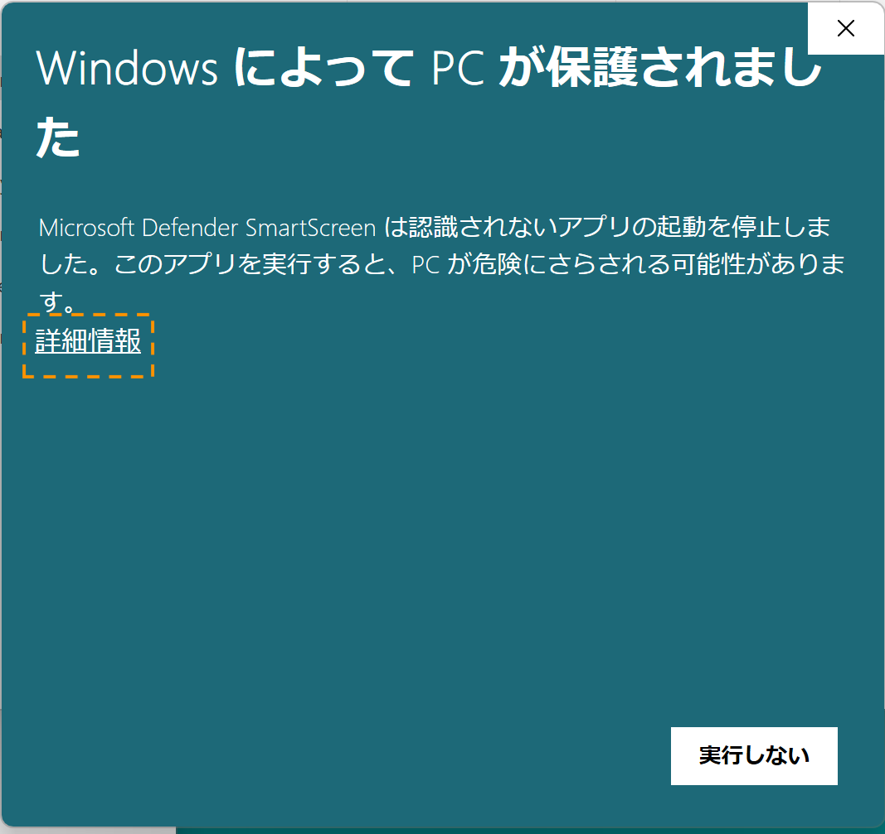

# トラブルシューティング

## アプリケーションの起動がブロックされる

WindowsでもmacOSでも、アプリケーションをダウンロードしてから初回の起動時はセキュリティにより起動をブロックされます。

Windowsの場合、インターネットに接続されていなければ、「現在、SmartScreenを実行できません」というダイアログが出てきます。この場合は「実行する」をクリックすると起動します。

インターネットに接続されている場合、「WindowsによってPCが保護されました」というダイアログが出ますが、「詳細情報」をクリックすると、「実行」のボタンが現れるので、そこから起動できます。

macOSの場合、Finderやデスクトップ上で、アプリケーションのファイルをダブルクリックでなく右クリックのメニューから「開く」を選択して起動してください。この方法で、ダイアログに起動するのオプションが現れます。

Windowsでも、macOSでも、一度起動した後は通常のアプリケーションと同じように起動することが可能です。

## 音アプリケーションが起動しない

[Maxが正しくインストールされているか確認してください。](../Preparation/Software/index.md#cycling-74-max)

## 音アプリケーションで音が反応していない

- アプリケーションの「Audio Settings」をクリックして、出てきたウィンドウのメニューの「INPUT DEVICES」が使用しているオーディオインターフェースの名前になっているか確認してください。
- 「DSP」のボタンが緑色に点灯しているか確認してください。していなければクリックしてDSPを起動してください。
- 使っているトーンチャイムの音程と、アプリケーション上の「Pitch」のダイヤルの音名が一致しているか確認してください。

## 音の情報が照明に反映されない

まず。音アプリケーションのLight Brightnessのスライダーをドラッグして動かした時に照明の明るさが変わるかをチェックしてください。

### スライダーで照明の明るさが変わる

照明機器の接続自体は問題ありません。音アプリケーションの「Range」の項目で、「Output」が255になっているか確認した上で、「Input」を0.07などから小さくしてみて、反応あるか確かめてください。

### スライダーでも照明の明るさが変わらない

照明機器の接続に問題があります。

- DMX USB PROのUSBコネクタの隣にあるLEDが、スライダーを動かした時に光るか確認してください。反応がない場合、音プログラム側でDMX USB PROを認識できていません。他に接続されているUSB機器がないか確認してください。
- ディマー側の1,2,3,4という数字の側のLEDが光っているか確認してください。光らなければ、DMXケーブルの接続ができていないか、チャンネルの設定が間違っています。
- ディマー側で信号を受信できているのに光らない場合は、ライトそのものに問題があります。きちんと白熱電球を使用しているか、ライト本体の電源が入っているか確認して下さい。

## 音の情報が映像に反映されない

音アプリケーションの「Device Communication」で以下の事項を確認してください。

- `LOCAL_MODE`のボタンは黄色になっていますか？なっていなければクリックしてください。
- 右下にある"port"の数字が、映像アプリケーションのportの数字と同じか確認してみてください。
    - デフォルトでは通信ポートは8888となっていますが、他のアプリケーションとポートが競合している可能性があります。8000番以降の番号で適当な数字をいくつか試してみてください。
- OSのファイアウォール設定により、アプリケーション間の通信をうまく行えないことがあります。
    - 必要に応じて、一時的にファイアウォール設定をオフにしてください。（インターネットに接続している場合などは、セキュリティ上のリスクがあることに注意してください。）